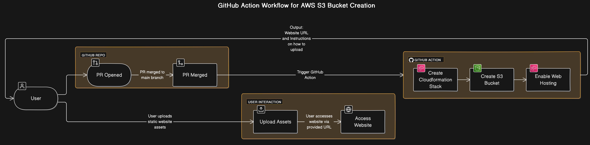

# M25 Static Website Assets Offering

This service is now offered via https://panel.demo.meshcloud.io.

You can order it from your AWS tenant in meshStack. The service is only discoverable if your Workspace is tagged with `BusinessUnit: M25`.

Steps:

- Navigate to your Workspace
- Navigate to your Project
- Navigate to your AWS tenant
- Under Marketplace, select `M25 Static Website Assets` service
- Fill in the configuration as required
- Add Service
- Once it's in a successful state, navigate to https://github.com/likvid-bank/static-website-assets/actions and click on your building block UUID.
  You will find detailed instructions under `deploy summary`

Old workflow

To order a static website, create a **pull request** with an empty file committed under `buckets/ (content of this file won't affect the workflow). Merging this PR will trigger a GitHub action workflow that creates an S3 bucket through which you can upload your static website assets and host your website. After the bucket is created, you will receive your website's URL and further instructions on how to upload your assets.

This currently does NOT support:

- HTTPS
- Custom Domains

## Create an S3 Bucket

> as a convention, use a commit message "create: filename"

- Create an empty file under `buckets/` with a unique name (bucket name will be this name prefixed with "m25")
- Open a PR with your change.
- Merge PR
- Navigate to your commit workflow in <https://github.com/likvid-bank/static-website-assets/actions> and follow instructions in the summary.

## Delete an S3 Bucket

> as a convention, use a commit message "delete: filename"

- Delete the file under `buckets`, then commit your change.
- Open a PR with your change.
- Merge PR

>IMPORTANT: In both creation and deletion, make sure you only commit one file change (i.e. adding or deleting a file), modifications are not detected by the workflow.

